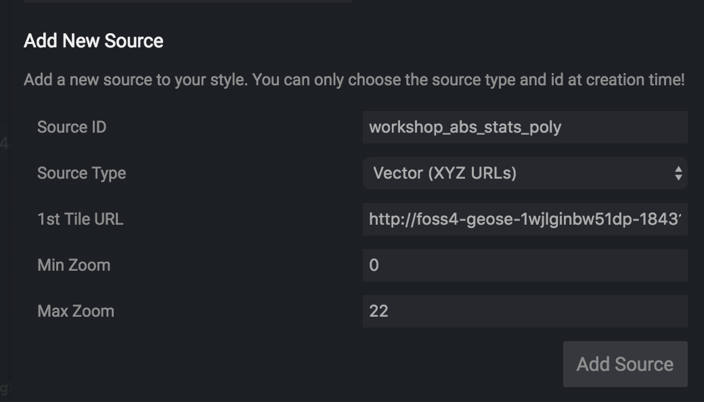
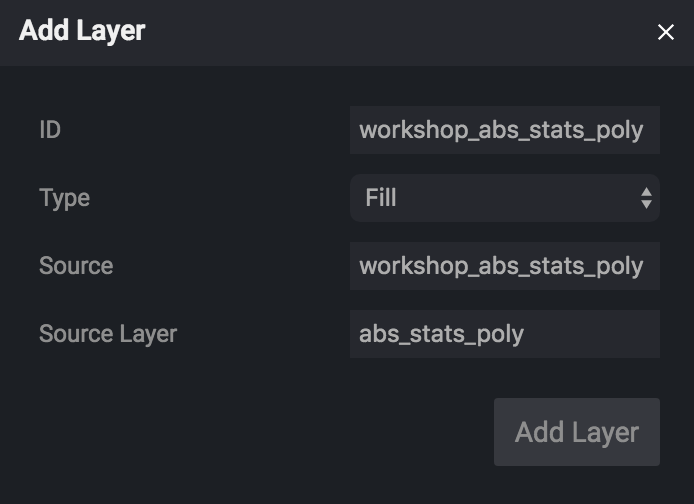
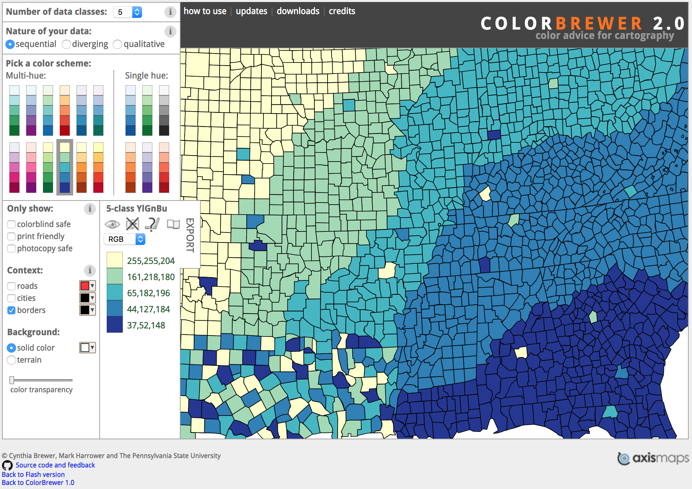
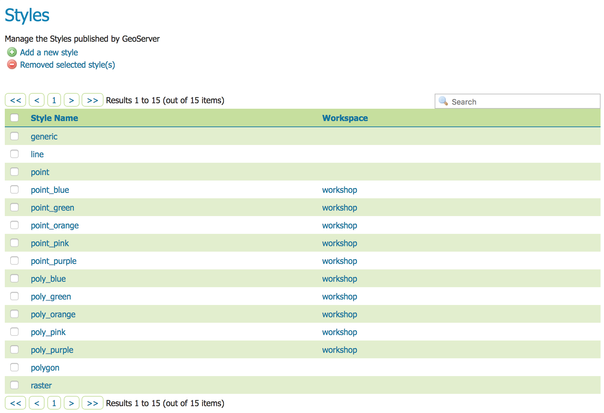

# 0 to 100 on AWS – Building a full stack web mapping application with PostGIS, GeoServer, OpenLayers and ReactJS

#### FOSS4G SotM Oceania - Afternoon Workshop #1 - 20th November 2018

## 6. Style Vector Tiles in Maputnik

To style the Vector Tiles we're going to use the Mapbox Style specification. A good, open source friendly, way to create and edit these styles is to use the Maputnik visual style editor. A hosted version of this is available at [http://editor.openmaptiles.org](http://editor.openmaptiles.org).

To start with we'll explore how you can use Maputnik to generate JSON files in [MB Style spec](https://www.mapbox.com/mapbox-gl-js/style-spec), and then to speed things up a bit we'll load some pre-generated style files to GeoServer.

**1.** In a browser open up the hosted version of [Maputnik](http://editor.openmaptiles.org/#8/-37.8/144.5) and from the ***Gallery Styles*** select ***Positron***. Using this style will give us a background map for some context.

**2.** From the top menu select ***Sources*** and then add a new source with the following parameters in the bottom section of the dialog:

| Parameter | Value |
|:-- |:-- |
| Source ID | `workshop_abs_stats_poly` |
| Source Type | `Vector (XYZ URLs)` |
| 1st Tile URL | `http://<LOAD_BALANCER_DNS_NAME>/geoserver/gwc/service/wmts?REQUEST=GetTile&SERVICE=WMTS&VERSION=1.0.0&LAYER=workshop:abs_stats_poly&STYLE=&TILEMATRIX=EPSG:900913:{z}&TILEMATRIXSET=EPSG:900913&FORMAT=application/x-protobuf;type=mapbox-vector&TILECOL={x}&TILEROW={y}` |
| Min Zoom | `0`|
| Max Zoom | `22` |



**3.** Close the Sources dialog, then in the left-hand pane, click on ***Add Layer*** and add the polygon ABS stats layer by populating the dialog with the following parameters.

| Parameter | Value |
|:-- |:-- |
| ID | `workshop_abs_stats_poly` |
| Type | `Fill` |
| Source | `workshop_abs_stats_poly` |
| Source Layer | `abs_stats_poly`|



**4.** Once the layer has been added you'll see it at the bottom of the ***Layers*** panel in a lovely default black style. You can play around with the fill and outline properties of the style by first highlighting the layer and then modifying the ***Color*** and ***Outline Color*** under ***Paint Properties***.

**5.** Maputnik allows you to define symbol classes, scale control, proportional symbols and various other styling properties supported by the [MB Style spec](https://www.mapbox.com/mapbox-gl-js/style-spec). We're aiming to create styles that will allow us to define a colour ramp for symbolising the pre-calculated Jenks Classes for various ABS statistics, to be applied to the `abs_stats_poly` layer, and a proportional symbol style for the `abs_stats_point` layer.

**6.** As the views that we created combine four different types of statistical area geographies, we want to create a different layer to represent each statistical area. In the layers panel, with the `workshop_abs_stats_poly` layer selected, click on the duplicate button 3 times so that there are four layers in total.


**7.** Select each layer and change the ID in the layer properties so that you have
  - `workshop_abs_stats_poly_SA1`,
  - `workshop_abs_stats_poly_SA2`,
  - `workshop_abs_stats_poly_SA3` and
  - `workshop_abs_stats_poly_SA4`.

**8.** Set the filter, min and max zoom of the layers as per the following table.

| Layer ID | Min Zoom | Max Zoom | 
|:-- |:-- | :-- |
| `workshop_abs_stats_poly_SA1` | 13 | 24 |
| `workshop_abs_stats_poly_SA2` | 9 | 13 |
| `workshop_abs_stats_poly_SA3` | 6 | 9 |
| `workshop_abs_stats_poly_SA4` | 0 | 6 |

**9.** Choose a different color for each layer so that you can easily see it displayed when zooming in and out. At this point you should see the same data presented in different colors as you zoom in and out on the map.

**10.** Now we'll filter the features so that we only see features for the appropriate statistical area for each layer. Select the `workshop_abs_stats_poly_SA1` layer and click on ***Filter > Add Filter*** in the layer properties panel. Add a new filter with the values provided below.


**11.** Add a filter to each of the other layers replacing the `SA1` with the appropriate value. You should now have layers that represent each of the statistical area types with appropriate scale control.

**12.** Now we'll extend the styling a bit further and configure symbology classes to display a different color for the Jenks natural breaks pre-calculated for the statistics fields, using median age as an example. Select the `workshop_abs_stats_poly_SA1` layer and using the JSON editor at the bottom of the layer properties panel, set the `"paint"` property by pasting the following code snippet.

```
{
  "fill-outline-color": {
    "property": "median_age_persons_cl",
    "type": "categorical",
    "stops": [
      [{
        "zoom": 0,
        "value": 1
      }, "rgba(0, 0, 0, 1)"],
      [{
        "zoom": 0,
        "value": 2
      }, "rgba(0, 0, 0, 1)"],
      [{
        "zoom": 0,
        "value": 3
      }, "rgba(0, 0, 0, 1)"],
      [{
        "zoom": 0,
        "value": 4
      }, "rgba(0, 0, 0, 1)"],
      [{
        "zoom": 0,
        "value": 5
      }, "rgba(0, 0, 0, 1)"]
    ]
  },
  "fill-color": {
    "property": "median_age_persons_cl",
    "type": "categorical",
    "stops": [
      [{
        "zoom": 0,
        "value": 1
      }, "rgba(0, 0, 0, 1)"],
      [{
        "zoom": 0,
        "value": 2
      }, "rgba(0, 0, 0, 1)"],
      [{
        "zoom": 0,
        "value": 3
      }, "rgba(0, 0, 0, 1)"],
      [{
        "zoom": 0,
        "value": 4
      }, "rgba(0, 0, 0, 1)"],
      [{
        "zoom": 0,
        "value": 5
      }, "rgba(0, 0, 0, 1)"]
    ]
  },
  "fill-antialias": true,
  "fill-opacity": {
    "property": "median_age_persons_cl",
    "type": "categorical",
    "stops": [
      [{
        "zoom": 0,
        "value": 1
      }, 0.8],
      [{
        "zoom": 0,
        "value": 2
      }, 0.8],
      [{
        "zoom": 0,
        "value": 3
      }, 0.8],
      [{
        "zoom": 0,
        "value": 4
      }, 0.8],
      [{
        "zoom": 0,
        "value": 5
      }, 0.8]
    ]
  }
}

```

**13.** Now let's add some color by selecting a nice color ramp using [Color Brewer 2.0](http://colorbrewer2.org/). Change the number of data classes to 5, and select a color scheme.



**14.** Now modify the ***Color*** property for each `median_age_persons_cl` value to match the colors selected. Be sure to replace the entire `rgba(...)` function with the hex value of the new colour, inside the quotes.

**15.** You should now have a color ramp that symbolises using Jenks natural breaks classes displaying the median age for SA1 geographies.

**16.** Repeat the process for the other three layers, you can just copy and paste the `"paint"` property from one layer to the next to save time.

**17.** If you like you can export these styles as a JSON file from the ***Export*** button on the top bar.  Note that this will include all layers in the background map too, so if you just want the layers we've created you would need to remove all other layers before exporting).

Rather than repeat this process to define styles for the `abs_stats_point` layers and for all the ABS statistic fields, we'll save some time and use some style files that have been pre-generated with the `python/generate_abs_mb_style.py` script.

These style files provide different colour ramps that can be used for both the `abs_stats_poly` and `abs_stats_point` layers and have template values for the field (`<REPLACE_FIELD>`) and the GeoServer URL (`<REPLACE_BASE_GEOSERVER_URL>`) that will be replaced once they are loaded in the client application.

### Configure styles in GeoServer

**1.** In the GeoServer web admin interface open the ***Data > Styles*** page and click ***Add a new style***.

**2.** Fill in the properties as per the table below and then click on the ***Choose File*** button, select the `styles/poly_blue.json` from the workshop files directory, and click ***Upload...***

| Parameter | Value | 
|:-- |:-- |
| Name | poly_blue |
| Workspace | workshop |
| Format | MBStyle |

**3.** Press the ***Submit*** button to save the style.

**4.** Repeat this process to upload all the style files located in the `styles` folder so that there are 5 point styles and 5 poly styles.



**5.** Finally, we need to allow anonymous access to these styles via the GeoServer REST API so that the web application we build can access them. Open the ***Security > Authentication*** page.

**6.** In the ***Filter Chains*** section click on ***Add service chain***

**7.** In the ***Filter chain*** page fill in the following properties in the ***Chain settings*** section and then click ***Close***.

| Parameter | Value | 
|:-- |:-- |
| Name | `rest-styles` |
| Comma delimited list of ANT patterns (with optional query string) | `/rest/workspaces/**/styles/**` |
| Disable security for this chain | selected |


**8.** Back on the ***Authentication*** page in the ***Filter Chains*** section, move the ***rest-styles*** chain so that it is positioned above the ***rest*** filter chain.


**9.** Click ***Save***.

> ***Please note*** that you must click the ***Save*** button at the bottom of the page to persist changes to the filter chains.  Closing the filter chain edit dialog does not persist any changes.

***

**Previous**: [5. Publish vector tiles](section-5-publish.md) | **Up**: [Index](README.md) | **Next**: [7. Client application](section-7.md)
